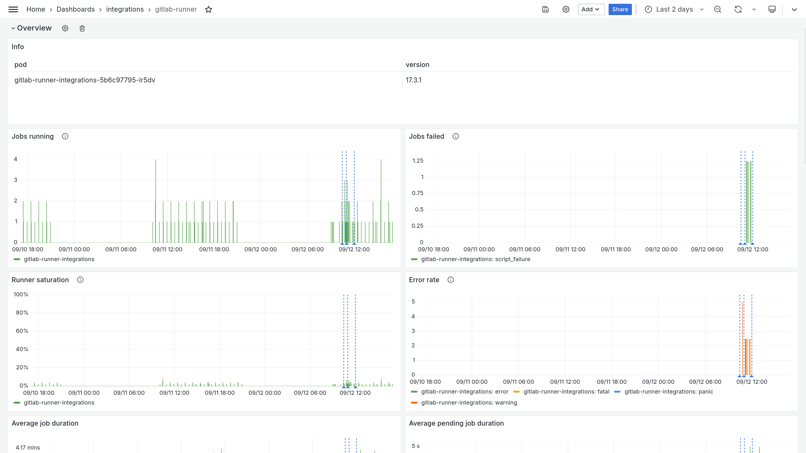
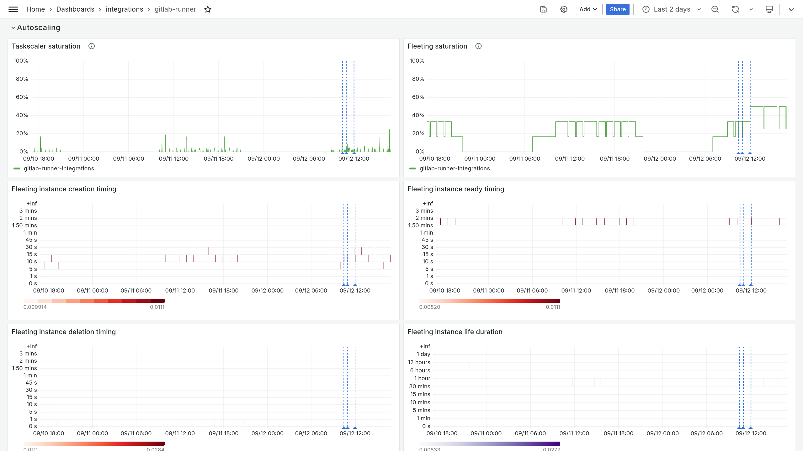

# Set up monitoring

With the dynamic nature of auto scaling, it is recommended to monitor your GitLab CI infrastructure to know when something goes wrong or if anything could be improved. This document describes the basics to monitor your GitLab CI infrastructure when using the Hetzner Fleeting plugin.

## Collect the gitlab-runner metrics

To collect gitlab-runner metrics, you must first [enable the gitlab-runner metrics endpoint](https://docs.gitlab.com/runner/monitoring/#configuration-of-the-metrics-http-server).

Once the metrics endpoint is enabled, you must scrape that endpoint with you monitoring stack. Below is an example using a Prometheus scrape configuration:

```yml
scrape_configs:
  - job_name: gitlab-runner
    static_configs:
      - targets:
          - my-gitlab-runner-host:9252
```

## Trigger alerts

When a problem occurs, you want to be informed to possibly prevent a large amount of failed pipelines.

The following Prometheus alert rule is used to trigger an alert when metrics could not be scraped:

```yml
groups:
  - name: GitLab Runner
    rules:
      - alert: NoMetrics
        annotations:
          summary: No metrics were scraped for the past 1m.
        expr: >
          absent(up{job="gitlab-runner"})
          or
          up{job="gitlab-runner"} == 0
        for: 1m
```

The following Prometheus alert rule is used to trigger an alert when an error occurs in the gitlab-runner:

```yml
groups:
  - name: GitLab Runner
    rules:
      - alert: GitLabRunnerErrors
        annotations:
          summary: GitLab Runner error rate is more than 0 for the past 5m.
        expr: >
          increase(
            gitlab_runner_errors_total{job="gitlab-runner", level=~"error|fatal|panic"}[1m]
          ) > 0
        for: 5m
```

The following Prometheus alert rule is used to trigger an alert when worker processing errors occurs in the gitlab-runner (e.g. the fleeting plugin could not be started):

```yml
groups:
  - name: GitLab Runner
    rules:
      - alert: GitLabRunnerWorkerProcessingErrors
        annotations:
          summary: GitLab Runner worker processing error rate is more than 0 for the past 5m.
        expr: >
          increase(
            gitlab_runner_worker_processing_failures_total{job="gitlab-runner", failure_type="other"}[1m]
          ) > 0
        for: 5m
```

The following Prometheus alert rule is used to trigger an alert when GitLab API request errors occurs in the gitlab-runner:

```yml
groups:
  - name: GitLab Runner
    rules:
      - alert: GitLabAPIRequestErrors
        annotations:
          summary: GitLab API request error rate is more than 0 for the past 5m.
        expr: >
          increase(
            gitlab_runner_api_request_statuses_total{job="gitlab-runner", status=~"(4|5).."}[1m]
          ) > 0
        for: 5m
```

The following Prometheus alert rule is used to trigger an alert when GitLab API request errors occurs in the gitlab-runner:

```yml
groups:
  - name: GitLab Runner
    rules:
      - alert: GitLabRunnerJobQueueDuration
        annotations:
          summary: GitLab Runner job queue duration is more than 5 seconds for the past 5m.
        expr: >
          sum (
            increase(gitlab_runner_job_queue_duration_seconds_sum{job="gitlab-runner"}[1m])
            /
            increase(gitlab_runner_job_queue_duration_seconds_count{job="gitlab-runner"}[1m])
          ) by (job) > 5
        for: 5m
```

## Dashboard

A dashboard presents information on how the gitlab-runner is behaving. For example, if you need to reduce costs, to provide enough capacity or research which server type works best for you.

Below is a dashboard example:




A Grafana dashboard definition is [available in the Fleeting plugin repository](../../tools/dashboard.json).
